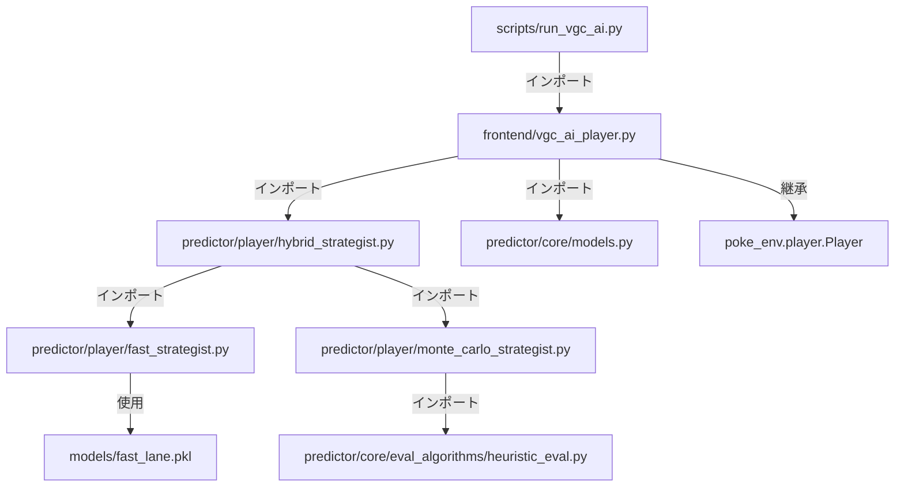

# VGC AI Battle System - 現状サマリ

**最終更新**: 2025-12-29 18:22 JST

---

## 🎯 プロジェクト概要

**VGC AI Battle System** は、ポケモンVGC（Video Game Championships）のダブルバトルに対応したAIプレイヤーシステムです。

### 主な機能
1. **VGC AIプレイヤー** - 人間のチャレンジを受けて自動対戦
2. **勝率予測** - ターン毎にAI/相手両方の勝率を表示
3. **行動予測** - 各ポケモンの予測行動と確率をダブルバトル形式で表示
4. **Open Team Sheet対応** - Bo3フォーマットで相手の技が見える

---

## 📁 ディレクトリ構造

```
new_watch_game_system/
│
├── 🎮 frontend/                    # プレゼンテーション層
│   ├── vgc_ai_player.py           # ★ メインAIプレイヤー
│   └── spectator.py               # 観戦システム
│
├── 🧠 predictor/                   # コア予測エンジン（安定版）
│   ├── player/                    # ストラテジスト実装
│   │   ├── hybrid_strategist.py   # Fast-Lane + MCTS統合
│   │   ├── fast_strategist.py     # LightGBM即時推論
│   │   └── monte_carlo_strategist.py # Pure MCTS
│   ├── core/                      # モデル・評価関数
│   │   ├── models.py              # BattleState, ActionCandidate等
│   │   └── eval_algorithms/       # 評価アルゴリズム
│   └── engine/                    # 外部連携
│       └── smogon_calc_wrapper.py # ダメージ計算
│
├── 🚀 scripts/                     # エントリーポイント
│   ├── run_vgc_ai.py              # ★ AI起動スクリプト
│   └── run_battle_spectator.py    # 観戦起動スクリプト
│
├── 📊 models/                      # 学習済みモデル
│   └── fast_lane.pkl              # LightGBMモデル
│
├── 🏗️ src/                         # DDDテンプレート（移行中）
│   ├── domain/                    # ドメイン層
│   ├── application/               # アプリケーション層
│   ├── infrastructure/            # インフラ層
│   └── ui/                        # UI層
│
├── 📚 docs/                        # ドキュメント
│   ├── TECH_STACK.md              # 技術スタック
│   └── PROGRESS.md                # 進捗管理
│
├── 🎲 pokemon-showdown/            # Showdownサーバー（サブモジュール）
│
└── 🐍 .venv/                       # Python仮想環境
```

---

## 🔄 ファイル間の依存関係



---

## 📝 主要ファイル詳細

### 1. `scripts/run_vgc_ai.py` - AI起動スクリプト

**役割**: コマンドラインからAIを起動するエントリーポイント

**処理フロー**:
```
1. コマンドライン引数をパース
   - --format: バトルフォーマット (デフォルト: gen9vgc2026regfbo3)
   - --team: チームファイル (デフォルト: サンプルチーム)
   - --strategy: 戦略 (heuristic / mcts)
   - --name: ユーザー名 (デフォルト: VGC_AI)

2. VGCAIPlayerインスタンスを作成

3. accept_challenges()でチャレンジ待機
```

**サンプルチーム**: Tornadus / Urshifu / Raging Bolt / Entei / Amoonguss / Landorus

---

### 2. `frontend/vgc_ai_player.py` - VGC AIプレイヤー

**役割**: poke-envのPlayerを継承し、VGCダブルバトルを処理

**クラス構造**:
```python
class VGCAIPlayer(Player):
    """
    主要メソッド:
    - __init__(): HybridStrategistを初期化
    - teampreview(): チーム選出 (/team 1234)
    - choose_move(): 行動選択のメインロジック
    - _choose_heuristic_action(): 威力ベースの行動選択
    - _choose_mcts_action(): MCTS戦略
    - _display_action_predictions(): 行動予測の表示
    - _predict_opponent_actions(): 相手の行動予測 (OTS対応)
    """
```

**行動選択フロー (choose_move)**:
```
1. 現在の盤面情報を表示
   - 自分のアクティブポケモン (HP%)
   - 相手のアクティブポケモン (HP%)

2. BattleStateに変換して予測
   - HybridStrategist.predict_both()を呼び出し
   - Fast-Lane (即時) + Slow-Lane (MCTS) の両方を実行

3. 勝率を表示
   ────────────────────────────────────────
   📊 ターン X 勝率予測
   ────────────────────────────────────────
     🤖 AI (P1):      63.2%  ████████████
     👤 相手 (P2):    36.8%  ███████
   ────────────────────────────────────────

4. 行動予測を表示
   ╔══════════════════════════════════════════════════════════╗
   ║ 🎯 行動予測 (ダブルバトル)                               ║
   ╠══════════════════════════════════════════════════════════╣
   ║ P1 (VGC_AI)                                              ║
   ╟──────────────────────────────────────────────────────────╢
   ║   Tornadus                                               ║
   ║     Bleakwindstorm    40%  ████████                      ║
   ║     Tailwind          35%  ███████                       ║
   ...

5. 戦略に基づいて行動選択
   - heuristic: 威力最大の技を選択
   - mcts: MCTS推奨の行動を選択

6. BattleOrderを返す
```

**ターゲット指定**:
- `-1` = 相手スロット1（左）
- `-2` = 相手スロット2（右）
- `1` = 味方スロット1
- `2` = 味方スロット2

---

### 3. `predictor/player/hybrid_strategist.py` - ハイブリッド戦略エンジン

**役割**: Fast-Lane (LightGBM) + Slow-Lane (MCTS) を統合

**アーキテクチャ**:
```
┌─────────────────────────────────────────────────┐
│           HybridStrategist                      │
├─────────────────────────────────────────────────┤
│  Fast-Lane                                      │
│  ├─ LightGBMモデル (< 1ms)                      │
│  └─ 即時勝率推定                                │
├─────────────────────────────────────────────────┤
│  Slow-Lane                                      │
│  ├─ Pure MCTS (10~100ms)                        │
│  └─ 精密計算・最適行動探索                      │
├─────────────────────────────────────────────────┤
│  (将来) AlphaZero-Lane                          │
│  └─ Policy/Value NN + MCTS                      │
└─────────────────────────────────────────────────┘
```

**主要メソッド**:
```python
predict_quick(battle_state) -> HybridPrediction
    # Fast-Laneで即時応答

predict_precise(battle_state) -> HybridPrediction  # async
    # Slow-Laneで精密計算

predict_both(battle_state) -> (fast_result, slow_result)
    # 両方実行（同期版）
```

---

### 4. `predictor/player/monte_carlo_strategist.py` - MCTS戦略

**役割**: モンテカルロ木探索による勝率予測・最適行動探索

**アルゴリズム**:
```
1. 現在の盤面から全ての合法手を列挙
2. 各行動について n_rollouts / len(actions) 回シミュレーション
3. シミュレーション: バトル終了までランダムな手を打つ
4. 勝敗を記録し、最も勝率の高い行動を返す
```

**パラメータ**:
- `n_rollouts`: シミュレーション回数 (デフォルト: 300)
- `max_turns`: 最大ターン数 (デフォルト: 15)

---

### 5. `predictor/core/models.py` - データモデル

**主要クラス**:
```python
@dataclass
class BattleState:
    player_a: PlayerState      # P1の状態
    player_b: PlayerState      # P2の状態
    turn: int                  # 現在のターン
    legal_actions: Dict        # 合法手

@dataclass
class PlayerState:
    name: str                  # プレイヤー名
    active: List[PokemonBattleState]  # アクティブポケモン
    reserves: List[str]        # 控え

@dataclass
class PokemonBattleState:
    name: str                  # ポケモン名
    hp_fraction: float         # HP割合 (0.0~1.0)
    status: Optional[str]      # 状態異常
    species: str               # 種族名
    slot: int                  # スロット番号
    moves: List[str]           # 技リスト
    item: Optional[str]        # 持ち物
    ability: Optional[str]     # 特性

@dataclass
class ActionCandidate:
    actor: str                 # 行動するポケモン
    slot: int                  # スロット
    move: str                  # 技
    target: Optional[int]      # ターゲット
```

---

## 🚀 起動方法

### 1. Showdownサーバー起動
```bash
cd pokemon-showdown
node pokemon-showdown start
```

### 2. VGC AI起動
```bash
cd /Users/kawashimawataru/Desktop/new_watch_game_system
source .venv/bin/activate
python scripts/run_vgc_ai.py --strategy heuristic
```

### 3. 対戦
1. ブラウザで http://localhost:8000 にアクセス
2. ユーザー名で参加、チームをインポート
3. 「VGC_AI」を検索してチャレンジ
4. フォーマット: `[Gen 9] VGC 2026 Reg F (Bo3)`

---

## 📊 出力フォーマット例

```
════════════════════════════════════════════════════════════
ターン 1 - VGC_AI の思考中... [heuristic]
════════════════════════════════════════════════════════════
  [0] Tornadus: HP 100%
  [1] Urshifu: HP 100%
  相手:
  [0] Ragingbolt: HP 100%
  [1] Fluttermane: HP 100%

────────────────────────────────────────
📊 ターン 1 勝率予測
────────────────────────────────────────
  🤖 AI (P1):      52.3%  ██████████
  👤 相手 (P2):    47.7%  █████████
────────────────────────────────────────

╔══════════════════════════════════════════════════════════╗
║ 🎯 行動予測 (ダブルバトル)                               ║
╠══════════════════════════════════════════════════════════╣
║ P1 (VGC_AI)                                              ║
╟──────────────────────────────────────────────────────────╢
║   Tornadus                                               ║
║     Bleakwindstorm    40%  ████████                      ║
║     Tailwind          35%  ███████                       ║
║     Taunt             15%  ███                           ║
║   Urshifu                                                ║
║     Surgingstrikes    45%  █████████                     ║
║     Closecombat       40%  ████████                      ║
║     Icespinner        15%  ███                           ║
╟──────────────────────────────────────────────────────────╢
║ P2 (相手)                                                ║
╟──────────────────────────────────────────────────────────╢
║   Ragingbolt                                             ║
║     Thunderbolt       35%  ███████                       ║
║     Dracometeor       30%  ██████                        ║
║     Thunderclap       25%  █████                         ║
║   Fluttermane                                            ║
║     Moonblast         50%  ██████████                    ║
║     Shadowball        35%  ███████                       ║
║     Protect           15%  ███                           ║
╚══════════════════════════════════════════════════════════╝
  行動[0]: bleakwindstorm -> target=-1
  行動[1]: surgingstrikes -> target=-1
```

---

## 🔧 行動予測の計算ロジック

### P1 (自分) の行動予測
1. MCTSの`alternatives`から各技の勝率を取得
2. 取得できない場合は**威力ベースのヒューリスティック**:
   - 攻撃技: 威力に比例したスコア
   - 守り技 (Protect等): スコア 30 (約10%)
   - 補助技: スコア 70
   - 全体技: 威力 × 1.1 ボーナス

### P2 (相手) の行動予測
1. **OTS (Open Team Sheet)** から技を取得 (Bo3フォーマット)
2. OTSがなければ既知の技を使用
3. 威力ベースで確率を計算

---

## 📝 変更履歴

| 日付 | 変更内容 |
|------|------|
| 2025-12-29 | ★ **ターゲット表示改善** - 単体技で実際のポケモン名を表示（例: `→ Chiyu`）|
| 2025-12-29 | ★ **ターゲット修正v2** - 正の値(1,2)が相手、強制交代のpass処理修正 |
| 2025-12-29 | ★ **Bo3フォーマット対応** - OTS有効化、相手の技が見える |
| 2025-12-29 | ★ **行動予測精度向上** - 威力ベースのヒューリスティック実装 |
| 2025-12-29 | ★ **行動予測表示** - ダブルバトル形式で表示 |
| 2025-12-24 | **両者勝率表示** - プログレスバー付き |
| 2025-12-23 | **DDD構造整備** - `src/`テンプレート作成 |

---

## ⚠️ 未解決の課題 / TODO

1. **MCTSの精度向上**
   - 現在のMCTSはランダムプレイアウトのみ
   - ヒューリスティック評価を組み込む予定

2. **勝率予測の精度**
   - Fast-Lane (LightGBM) の特徴量が13個と少ない
   - より多くの特徴量でモデルを再学習する必要あり

3. **選出ロジック**
   - 現在は先頭4匹固定 (`/team 1234`)
   - 相手チームを見て選出を最適化する必要あり

4. **AlphaZero統合**
   - Policy/Value モデルの学習が未完了

5. ~~**行動予測にターゲット方向を表示**~~ ✅ **完了** (2025-12-29)
   - 単体技で実際のポケモン名を表示するように実装済み
   - 例: `Closecombat → Chiyu  32%`

6. **フェーズベースのバトル状態管理機構** (2025-12-29追加)
   - 現在の状況（チームプレビュー / 通常行動選択 / 強制交代等）を明確に把握
   - ターンとフェーズごとに適切な処理を分岐するステートマシンを実装
   - `choose_move()`内の分岐を整理し、各フェーズごとに専用のハンドラを用意
   - 例:
     ```python
     class BattlePhase(Enum):
         TEAM_PREVIEW = "team_preview"
         MOVE_SELECTION = "move_selection"
         FORCE_SWITCH = "force_switch"
         WAITING = "waiting"
     
     def _get_current_phase(self, battle) -> BattlePhase:
         # バトル状態から現在のフェーズを判定
     
     def _handle_team_preview(self, battle): ...
     def _handle_move_selection(self, battle): ...
     def _handle_force_switch(self, battle): ...
     ```

7. **poke-env Bo3サポートの問題**
   - `game-bestof3-*`メッセージの解析でIndexErrorが発生
   - poke-envがBo3フォーマットを完全にサポートしていない可能性
   - 回避策: Bo3ではなく通常フォーマット`gen9vgc2026regf`を使うことも検討

8. **持ち物、特性を踏まえた行動**
   - 特性や持ち物を踏まえた行動ができていない
    - 例：こだわりメガネでHeatwaveを打った後、なぜかHeatwave以外の技を打とうとする
    - 例：Thunderclapなどの先制技を考慮していない？行動が多い  

---

**ファイル作成者**: Antigravity (AI Assistant)
